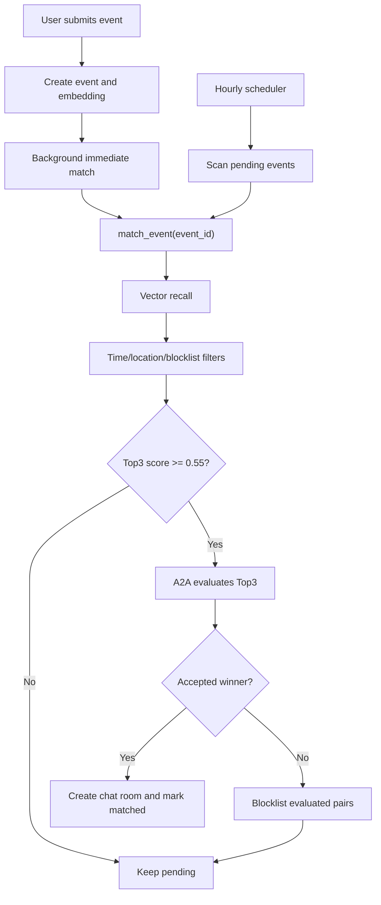

# Hourly Active Matching Design

## Context

The current backend starts `MatchScheduler` on app startup and runs active matching once per day at 18:00 Beijing time. Users now need matching to happen much closer to the moment an event is submitted, while still retrying unmatched events in efficient batches.

Existing matching already has the right core pipeline:

1. Ensure event embedding exists.
2. Run pgvector cosine search.
3. Apply hard filters for time, location, and blocklists.
4. Send candidate windows to A2A.
5. Mark both events matched and create a chat room when A2A accepts a winner.

The change is focused on scheduling, candidate thresholding, and pair deduplication.

## Goals

- Trigger one matching attempt immediately after a new event is submitted.
- Replace the daily 18:00 run with a global hourly scan of all `pending` events.
- Use vector coarse ranking as a cost gate before A2A.
- Send only the top 3 eligible vector candidates into A2A for each attempt.
- If no vector candidate reaches the threshold, leave the event as `pending` until the next hourly scan.
- If a pair enters A2A and does not produce a final match, never evaluate that event pair again automatically.
- Keep admin manual match and admin batch match behavior available.

## Non-Goals

- No per-event long-lived timers.
- No new queue service, broker, or external scheduler.
- No migration to a fully batched vector SQL algorithm in this iteration.
- No changes to passive matching invitation rules.
- No removal of manual admin controls.

## Threshold Decision

Use `VECTOR_MATCH_THRESHOLD = 0.55`.

The threshold was chosen from two read-only simulations run against the production container's embedding model:

| Scenario | Result |
| --- | --- |
| Information-rich synthetic events | Strong match recall stayed at 100% from `0.45` through `0.70`; bad candidates mostly fell below `0.50`. |
| Sparse/noisy conversational events | Strong match recall was 98.3% from `0.45` through `0.58`, then dropped to 96.7% at `0.60`, and 90.0% at `0.70`. |

Existing production event pairs also showed useful signal: same-activity matched pairs often score above `0.63`, but some plausible pairs land around `0.55`. Some unrelated same-city pairs can still score high, so the threshold cannot replace A2A. It should only block obviously weak candidates.

`0.55` is the best first operating point because it reduces low-quality A2A calls while preserving recall for short, conversational, incomplete event text.

## Architecture

### Scheduler

`MatchScheduler` becomes an hourly scheduler:

- On startup, create one background task.
- The task sleeps until the next hourly tick, then scans pending events.
- The scan uses independent sessions per event, as the current scheduler already does, so one failed event does not poison the whole batch.
- A run lock prevents overlapping scans if one hourly run takes longer than expected.

The scheduler should expose an internal method for the admin "run all" endpoint to keep working.

### Event Submission

Both event creation paths should trigger immediate matching after the event is persisted:

- `POST /api/v1/events`
- Agent draft event creation in `app/api/agent_chat.py`

The immediate attempt should run in the background after the request returns. It must use a fresh DB session and re-check that the event is still `pending`, matching the existing `_run_matching(event_id)` pattern.

Event updates do not automatically trigger matching in this iteration. Updated events remain part of the next hourly scan, and users/admin can still trigger manual matching if needed.

### Matching Pipeline

`MatchingService.match_event()` remains the single source of truth. It should change from two A2A windows to one Top3 A2A window:

1. Load and lock the source event.
2. Cancel it if expired or already started.
3. Ensure embedding and normalized city.
4. Run vector recall.
5. Apply time/location filters.
6. Exclude blocklisted event pairs and user pairs.
7. Keep candidates with vector score `>= 0.55`.
8. Send only the top 3 eligible candidates to A2A.
9. If A2A returns an accepted winner, commit the match.
10. If A2A evaluates candidates but no winner is accepted, add each evaluated pair to `match_blocklists`.
11. Return the source event to `pending` and increment `match_round` when no match is made.

If the source event has no candidates above threshold, no new blocklist rows are written. The event simply waits for future events to arrive or for the next hourly scan.

### Pair Deduplication

When a source/candidate pair reaches A2A and is rejected or produces no accepted winner, write an event-pair blocklist row:

- `event_a_id`
- `event_b_id`
- `user_a_id`
- `user_b_id`
- `reason = "a2a_rejected"`

The existing blocklist collector already excludes event pairs and user pairs. The implementation should add rows with canonical event order and avoid duplicate rows.

Manual force match is allowed to ignore prior A2A rejection. Existing reset endpoints may clear event status and scores; they should also clear related blocklist rows if the reset is intended to make the events testable again.

## Data Flow

## Error Handling

- Matching failures reset the source event to `pending` and re-raise/log the exception, preserving existing behavior.
- Scheduler errors are counted per event and logged without stopping the next event.
- Immediate background matching logs failure and does not affect the user-facing event creation response.
- Duplicate blocklist insert attempts should be ignored by checking for an existing canonical event pair before inserting.

## Testing Strategy

Add focused tests around pure policy and service behavior:

- Candidate windows now return only one Top3 window above threshold.
- Candidates below `0.55` do not enter A2A.
- A2A-rejected pairs are written to `match_blocklists`.
- Blocklisted pairs are skipped on later attempts.
- Scheduler computes hourly ticks and no longer waits for 18:00 Beijing time.
- Event creation registers an immediate background matching task.

Manual smoke after implementation:

- Create two compatible events and confirm immediate matching can create a room.
- Create an event with no strong candidate and confirm it remains `pending`.
- Run the admin scheduled matching endpoint and confirm it scans pending events.
